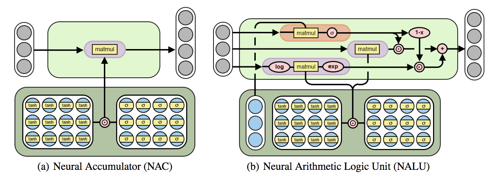
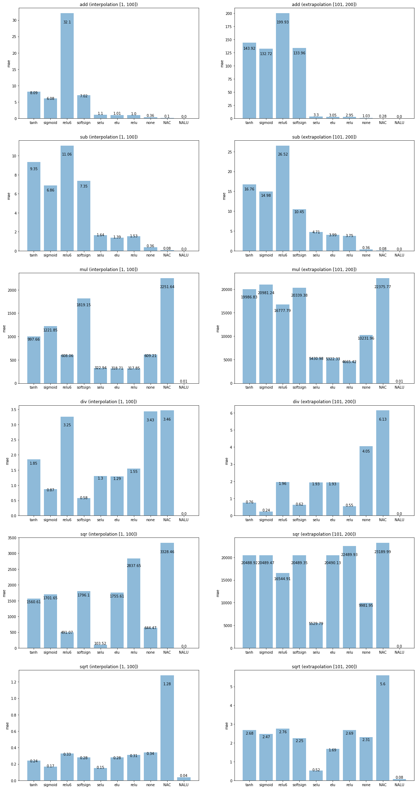

# Summary

This is a PyTorch implementation of an extended version of the [Neural Arithmetic Logic Units](https://arxiv.org/abs/1808.00508) (NALUs) from DeepMind. The original NALUs only
support operations on positive real numbers whereas this generalization with the help
of the `sign` operation extends the concept to negative real numbers. Thus the extention
is named *Signed* NALU or SNALU for short.

The implementation resides in the python module `nalu.py` and PyTorch 1.0 was used. 



# Changes

A traditional NALU is implemented as:
```
Additive NAC : a = W X
Multiplicative NAC: m = exp ( W log (|X| + e) )
where W = tanh(W_hat) * sigmoid(M_hat)

Gate cell: g = sigmoid(GX)
where G is a standard trainable parameter matrix

NALU: y = g * a + (1-g) * m 
where * is the element wise product
```

A SNALU differs in only two ways. 
The Gate cell `g` is independent of `X` and thus only depends on a latent variable `G`.
The multiplicative NAC `m` is multiplied by `prod(sign(X))`, where `sign` is the element wise signum function and `prod` multiplies all signs, yielding `sm` which is then used in the final SNALU.

```
Additive NAC : a = W X
Multiplicative NAC: m = exp ( W log (|X| + e) )
Signed multiplicative NAC: sm = prod(sign(X)) * m
where W = tanh(W_hat) * sigmoid(M_hat)

Gate cell: g = sigmoid(G)
where G is a latent variable

SNALU: y = g * a + (1-g) * sm 
where * is the element wise product
```

# Tests

Several tests shown in the paper, the *Static (non-recurrent) arithmetic tests* (appendix B),
are implemented.

It is first train on a range of number, then it is tested on a range of number
the network never saw: **interpolation** & **extrapolation**.

The range (-100, 100) is used for the first task and [-200, -100] and [100, 200] for the second.

The following image shows the results. See the jupyter notebook `train.ipynb` if
you want to know the full train procedure.



# Credits

This repository was forked from [arthurdouillard/nalu.pytorch](https://github.com/arthurdouillard/nalu.pytorch) and extended to also support multiplication with negative numbers using Signed Neural Arithmetic Logic Units (SNALUs).

# References

```
@misc{1808.00508,
Author = {Andrew Trask and Felix Hill and Scott Reed and Jack Rae and Chris Dyer and Phil Blunsom},
Title = {Neural Arithmetic Logic Units},
Year = {2018},
Eprint = {arXiv:1808.00508},
}
```
