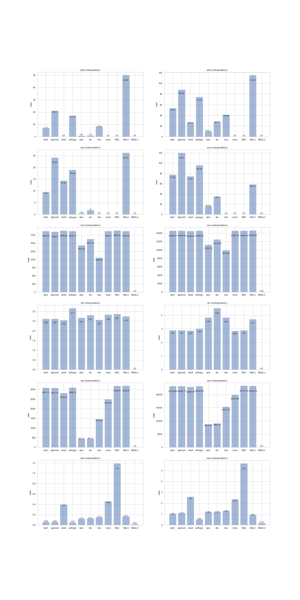

# Summary

This is a PyTorch implementation of [Neural Arithmetic Logic Units](https://arxiv.org/abs/1808.00508) [1]
from DeepMind.

The goal of this paper is to *count* using neural networks. Two networks are
presented, **NAC** and **NALU**. The first is used for addition & substraction
while the second is used for multiplication, division, square, and square root.

The paper was implemented in the python module `nalu.py`.


# Tests

Several tests are shown in the paper, I've only implemented what they called
the *Static (non-recurrent) arithmetic tests* (appendix B) where the network
must learn several kinds of operations.

It is first train on a range of number, then it is tested on a range of number
the network never saw: **interpolation** & **extrapolation**.

I've used the range [1, 100] for the first task and [101, 200] for the second.

The following image shows the results. See the jupyter notebook `train.ipynb` if
you want to know the full train procedure.



# References

```
@misc{1808.00508,
Author = {Andrew Trask and Felix Hill and Scott Reed and Jack Rae and Chris Dyer and Phil Blunsom},
Title = {Neural Arithmetic Logic Units},
Year = {2018},
Eprint = {arXiv:1808.00508},
}
```